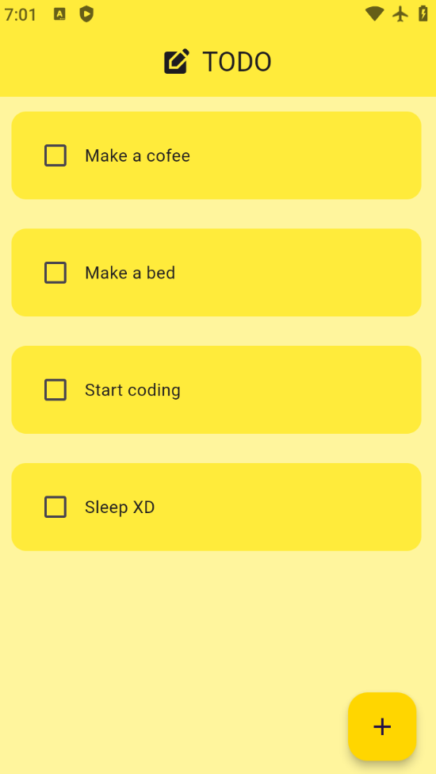
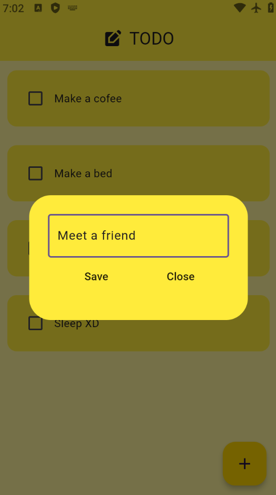
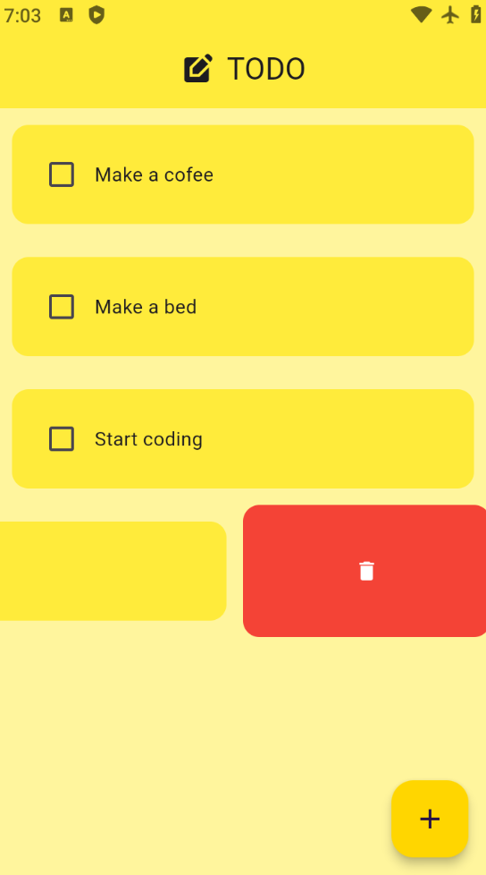

# To-Do App

A simple To-Do app built with Flutter that allows users to add and remove tasks easily.

## Features
- Add new tasks
- Remove tasks
- Persistent state (optional)
- Clean and simple UI

## Screenshots




## Installation
1. Clone the repository:
   ```bash
   git clone https://github.com/Lahiru20/todo-app-flutter.git
   ```
2. Navigate to the project directory:
   ```bash
   cd todo-app-flutter
   ```
3. Install dependencies:
   ```bash
   flutter pub get
   ```
4. Run the app:
   ```bash
   flutter run
   ```

## Requirements
- Flutter SDK
- Dart
- Android Studio or Visual Studio Code (with Flutter extension)

## Usage
1. Open the app.
2. Tap on the "Add Task" button to add a new task.
3. slide on a task and tap delete icon to remove it from the list.

## Contributing
Contributions are welcome! Feel free to submit a pull request.

